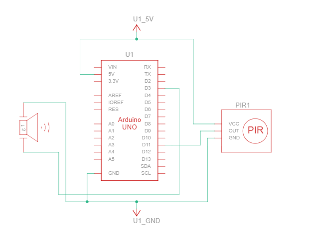

# PIR Motion Detection Alarm

## Description

This project is a PIR (Passive Infrared) Motion Detection Alarm using an Arduino Uno, a PIR motion sensor, and a passive buzzer. The PIR sensor continuously monitors its surroundings for changes in infrared radiation. When motion is detected, the Arduino activates the passive buzzer to produce an alarm tone. When no motion is detected, the buzzer remains silent.

## Working Principle

The PIR sensor detects movement by sensing changes in infrared energy emitted by people or animals.

- When motion is detected, the PIR sensor outputs a **HIGH** signal
- The Arduino reads this signal through a digital input pin
- **If signal is HIGH** → Arduino generates a 1000 Hz tone on the passive buzzer using the `tone()` function
- **If signal is LOW** → Arduino stops the buzzer using the `noTone()` function
- The process repeats continuously, providing real-time motion detection

## Components Required

- Arduino Uno
- PIR Motion Sensor (HC-SR501 or equivalent)
- Passive Buzzer
- Jumper Wires

## Pin Connections

| Component | Arduino Pin |
|-----------|------------|
| PIR Sensor OUT | Pin 7 |
| PIR Sensor VCC | 5V |
| PIR Sensor GND | GND |
| Buzzer (+) | Pin 13 |
| Buzzer (-) | GND |

## Circuit Diagram


## Schematic



## Features

- Detects human or object movement using a PIR sensor
- Activates a passive buzzer when motion is detected
- Displays motion status on the Serial Monitor
- Beginner-friendly Arduino security project
- Easy to understand and modify

## Applications

- Home security systems
- Intruder detection alarms
- Motion-activated warning systems
- Smart room automation
- Beginner embedded systems projects
- Basic IoT security prototypes

## Code Summary

```cpp
const int pirPin = 7;    // PIR sensor input
const int buzzerPin = 13; // Buzzer output

void setup() {
  pinMode(pirPin, INPUT);
  pinMode(buzzerPin, OUTPUT);
  Serial.begin(9600);
  Serial.println("PIR Motion Detector Active");
}

void loop() {
  int motionDetected = digitalRead(pirPin);
  
  if (motionDetected == HIGH) {
    digitalWrite(buzzerPin, HIGH);  // Buzzer ON
    tone(buzzerPin, 1000);          // 1000 Hz tone
    Serial.println("Motion Detected!");
  } else {
    digitalWrite(buzzerPin, LOW);   // Buzzer OFF
    noTone(buzzerPin);
    Serial.println("No Motion");
  }
  
  delay(500);
}
```

## Expected Output

- Serial Monitor displays "Motion Detected!" when movement is detected
- Buzzer sounds at 1000 Hz when motion is detected
- Buzzer stops when motion is no longer detected

## PIR Sensor Specifications

| Parameter | Value |
|-----------|-------|
| Detection Range | 5-7 meters |
| Detection Angle | ~110° |
| Warm-up Time | 30-60 seconds |
| Output Type | Digital (HIGH/LOW) |
| Sensitivity | Adjustable |

## Tips

- PIR sensor has a warm-up time of about 30-60 seconds when first powered
- Adjust sensor sensitivity using the potentiometer on the sensor module
- Typical detection range: 5-7 meters
- Works best with slow movements
- Requires 5V power supply

## Troubleshooting

| Problem | Solution |
|---------|----------|
| No motion detected | Wait 60 seconds for warm-up, check connections |
| False alarms | Adjust sensitivity potentiometer on sensor |
| Buzzer doesn't sound | Check buzzer polarity and connections |

---

**Author**: Beginner Arduino Projects  
**Difficulty Level**: Beginner ⭐
