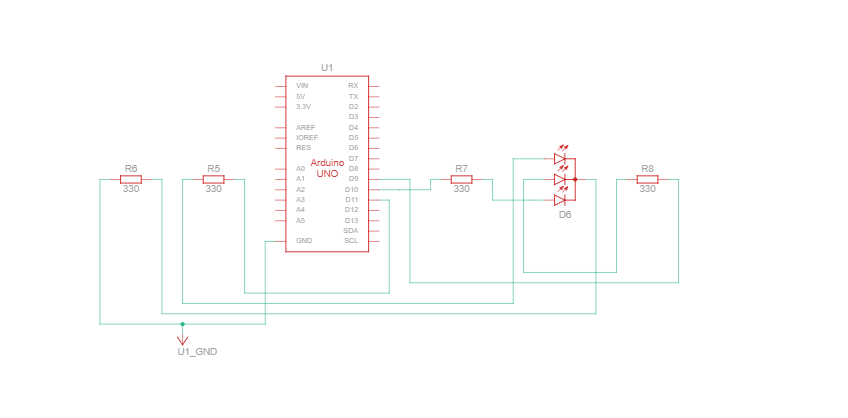

# RGB LED Color Control

## Description

This project controls an RGB LED using Arduino and Serial Monitor input. The RGB LED changes to different colors based on the color name entered through the Serial Monitor. By controlling the brightness of the three color channels (Red, Green, Blue) using PWM, different colors can be produced.

## Working Principle

The Arduino receives color names from the Serial Monitor using serial communication.

The RGB LED contains three internal LEDs:
- **Red** LED
- **Green** LED
- **Blue** LED

By controlling the brightness of these colors using PWM (`analogWrite()`), different colors are produced:
- `red` → Red Color
- `green` → Green Color
- `blue` → Blue Color
- `yellow` → Red + Green (Yellow)
- `purple` → Red + Blue (Purple)
- `cyan` → Green + Blue (Cyan)
- `white` → Red + Green + Blue (White)

## Components Required

- Arduino Uno
- RGB LED (Common Cathode)
- 3 × 220Ω Resistors
- Jumper Wires

## Pin Connections

| Color | Arduino Pin | Resistor |
|-------|------------|----------|
| Red | Pin 11 | 220Ω to GND |
| Green | Pin 9 | 220Ω to GND |
| Blue | Pin 10 | 220Ω to GND |
| Common (Cathode) | GND | - |

## Circuit Diagram


## Schematic



### ASCII RGB LED Layout

```
RGB LED (Common Cathode):
┌──────────────────────────┐
│  Common Pin → GND        │
│                          │
│  Red Pin   → 220Ω → P11  │
│  Green Pin → 220Ω → P9   │
│  Blue Pin  → 220Ω → P10  │
└──────────────────────────┘

                    Arduino Uno
                    ┌─────────────┐
        Pin 11  ────┤ 11 (Red)    │
                    │             │
        Pin 9   ────┤ 9  (Green)  │
                    │             │
        Pin 10  ────┤ 10 (Blue)   │
                    │             │
                    │       GND ──┤────────┐
                    │             │        │
                    └─────────────┘        │
                                          │
    RGB LED with Resistors:               │
    ┌────────────────────────────────┐   │
    │  R(11) G(9) B(10)             │   │
    │   ●     ●     ●               │   │
    │   │     │     │               │   │
    │   R     R     R  (220Ω)       │   │
    │   │     │     │               │   │
    │   └─────┴─────┴───────────────┼───┤ GND
```

**Note:** The circuit diagram image (circuit.png) should be placed in the same folder as this README.

## Color Mixing Chart

| Color | Red | Green | Blue | Result |
|-------|-----|-------|------|--------|
| Red | 255 | 0 | 0 | Red |
| Green | 0 | 255 | 0 | Green |
| Blue | 0 | 0 | 255 | Blue |
| Yellow | 255 | 255 | 0 | Yellow |
| Purple | 255 | 0 | 255 | Purple |
| Cyan | 0 | 255 | 255 | Cyan |
| White | 255 | 255 | 255 | White |
| Black | 0 | 0 | 0 | Off |

## Features

- Controls RGB LED using Serial Monitor input
- Supports multiple color selections
- Uses PWM for color mixing
- Beginner-friendly Arduino project
- Demonstrates serial communication and RGB color mixing
- Easy to modify by adding more custom colors

## Applications

- Learning RGB color mixing
- Understanding PWM in Arduino
- LED lighting projects
- Educational electronics demonstrations
- Foundation for smart lighting systems

## Code Summary

```cpp
const int redPin = 11;
const int greenPin = 9;
const int bluePin = 10;

void setup() {
  pinMode(redPin, OUTPUT);
  pinMode(greenPin, OUTPUT);
  pinMode(bluePin, OUTPUT);
  Serial.begin(9600);
  Serial.println("Enter color: red, green, blue, yellow, purple, cyan, white");
}

void loop() {
  if (Serial.available() > 0) {
    String color = Serial.readStringUntil('\n');
    color.toLowerCase();
    
    if (color == "red") {
      setColor(255, 0, 0);
    } else if (color == "green") {
      setColor(0, 255, 0);
    } else if (color == "blue") {
      setColor(0, 0, 255);
    } else if (color == "yellow") {
      setColor(255, 255, 0);
    } else if (color == "purple") {
      setColor(255, 0, 255);
    } else if (color == "cyan") {
      setColor(0, 255, 255);
    } else if (color == "white") {
      setColor(255, 255, 255);
    }
  }
}

void setColor(int r, int g, int b) {
  analogWrite(redPin, r);
  analogWrite(greenPin, g);
  analogWrite(bluePin, b);
}
```

## Expected Output

RGB LED changes color based on Serial Monitor input.

---

**Author**: Beginner Arduino Projects  
**Difficulty Level**: Beginner ⭐
