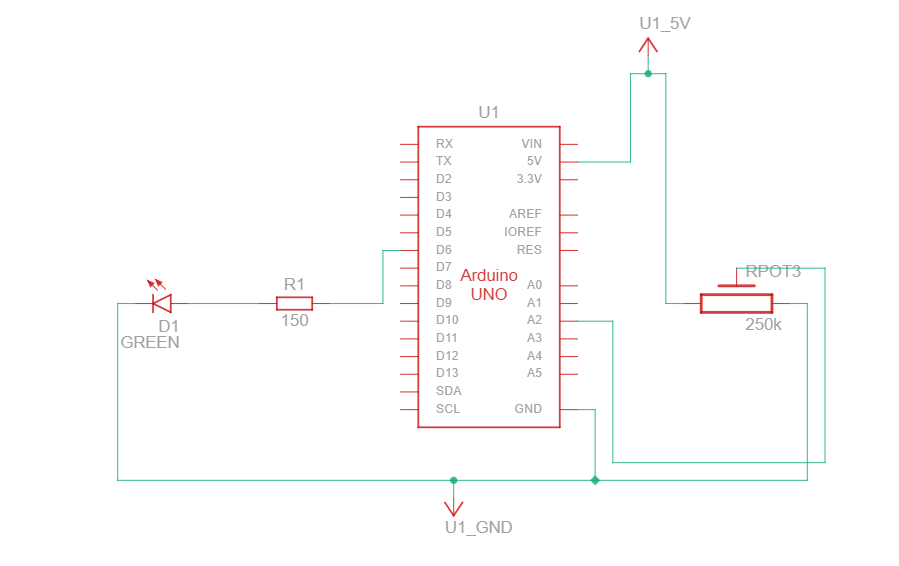

# Dimmable LED

## Description

This project controls the brightness of an LED using a potentiometer and Arduino. The potentiometer acts as an input device, allowing smooth adjustment of LED brightness through PWM (Pulse Width Modulation). Rotating the potentiometer increases or decreases the LED brightness in real-time.

## Working Principle

The Arduino reads the analog value from the potentiometer connected to an analog pin.

- The potentiometer value ranges from `0` to `1023`
- The Arduino maps this value to a PWM range of `0` to `255`
- The PWM signal controls the LED brightness
- Rotating the potentiometer:
  - **Lower values** → Decreases brightness
  - **Higher values** → Increases brightness

The LED brightness changes smoothly based on the potentiometer position.

## Components Required

- Arduino Uno
- 1 LED (any color)
- 1 × 220Ω Resistor
- Potentiometer (10kΩ)
- Breadboard
- Jumper Wires

## Pin Connections

| Component | Arduino Pin |
|-----------|------------|
| Potentiometer (middle pin) | A0 |
| Potentiometer (side pin 1) | 5V |
| Potentiometer (side pin 2) | GND |
| LED (positive) | Pin 9 (PWM) |
| LED (negative through 220Ω) | GND |

## Circuit Diagram


## Schematic



### ASCII Potentiometer and LED Layout

```
Potentiometer Connection:
┌─────────────────────┐
│  Potentiometer      │
│  5V ─────○─────│    │
│              ╱  \   │
│            ○      ○─→ A0 (Analog)
│              \  ╱   │
│  GND ────○─────│    │
└─────────────────────┘

LED Brightness Control:
                    Arduino Uno
                    ┌─────────────┐
        A0      ────┤ A0          │
        (Pot)       │             │
                    │             │
        Pin 9   ────┤ 9  (PWM)    │
        (LED)       │             │
                    │             │
                    │       GND ──┤────────┐
                    │             │        │
                    └─────────────┘        │
                                          │
    Breadboard: (LED with 220Ω)           │
    ┌────────────────────────────────┐   │
    │  LED                           │   │
    │   │(+)                         │   │
    │   ●                            │   │
    │   │                            │   │
    │   ├──────220Ω────────────────┬─┼───┤ GND
```

**Note:** The circuit diagram image (circuit.png) should be placed in the same folder as this README.

## Features

- Controls LED brightness using a potentiometer
- Demonstrates analog input reading
- Uses PWM for smooth brightness control
- Beginner-friendly Arduino project
- Real-time brightness adjustment

## Applications

- Learning analog input in Arduino
- Understanding PWM (Pulse Width Modulation)
- LED dimming systems
- Beginner embedded systems practice
- Foundation for sensor-based control projects

## Code Summary

```cpp
const int potPin = A0;  // Analog input pin
const int ledPin = 9;   // PWM output pin

void setup() {
  pinMode(ledPin, OUTPUT);
  Serial.begin(9600);
}

void loop() {
  int potValue = analogRead(potPin);        // Read pot (0-1023)
  int brightness = map(potValue, 0, 1023, 0, 255);  // Map to 0-255
  analogWrite(ledPin, brightness);          // Control LED
  
  Serial.print("Potentiometer: ");
  Serial.print(potValue);
  Serial.print(" -> Brightness: ");
  Serial.println(brightness);
  
  delay(100);
}
```

## Expected Output

- Serial Monitor displays potentiometer values (0-1023) and corresponding brightness (0-255)
- LED brightness changes smoothly as you rotate the potentiometer

## Tips

- Use PWM pins (3, 5, 6, 9, 10, 11) for `analogWrite()`
- Higher PWM values = brighter LED
- Lower PWM values = dimmer LED
- 0 = LED OFF, 255 = LED fully ON

---

**Author**: Beginner Arduino Projects  
**Difficulty Level**: Beginner ⭐
