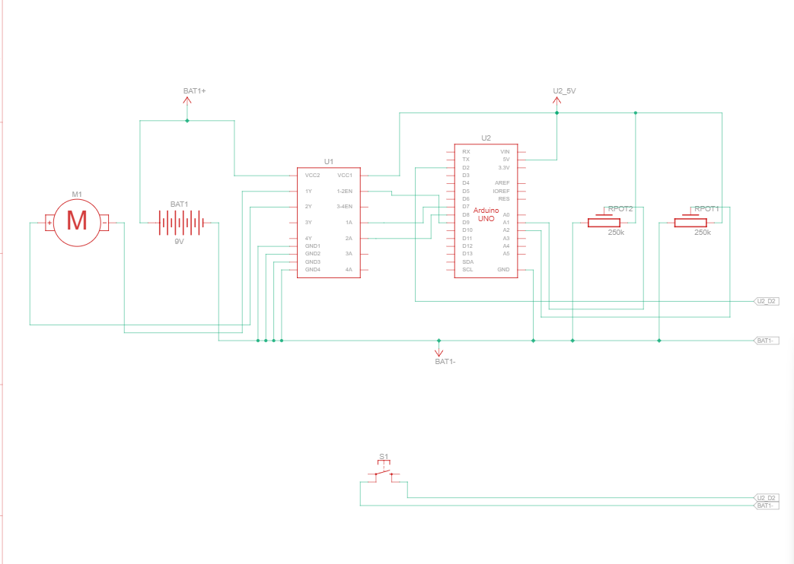

# DC Motor Speed and Direction Control

## Description

This project is a potentiometer-based DC motor control system using Arduino Uno and the L293D motor driver IC. The system uses one potentiometer to control the speed of the DC motor, another potentiometer to control the direction of rotation, and a push button to toggle the motor ON/OFF.

## Working Principle

The Arduino continuously reads input values from the two potentiometers and the push button.

**Speed Control:**
- A potentiometer connected to A1 controls the motor speed
- The potentiometer value ranges from **0 → 1023**
- This value is scaled to **0 → 255** and applied using PWM

**Direction Control:**
- A second potentiometer connected to A2 controls the motor direction
- Value below midpoint → **Forward Direction**
- Value above midpoint → **Reverse Direction**

**Push Button Control:**
- Acts as a toggle switch for motor ON/OFF
- First press → Motor ON
- Second press → Motor OFF

## Components Required

- Arduino Uno
- L293D Motor Driver IC
- DC Motor (3-6V)
- 2 Potentiometers (10kΩ)
- Push Button
- Breadboard
- Jumper Wires
- 9V Battery or External Power Supply

## Pin Connections

| Component | Arduino Pin |
|-----------|------------|
| L293D Enable (Pin 1) | Pin 9 (PWM) |
| L293D Input 1 (Pin 2) | Pin 7 |
| L293D Input 2 (Pin 7) | Pin 8 |
| Speed Potentiometer | A1 |
| Direction Potentiometer | A2 |
| Push Button | Pin 2 |

## Circuit Diagram


## Schematic



### ASCII L293D Motor Control Layout

```
L293D Motor Driver (DIP-16):
┌─────────────────────────┐
│ 1   2   3   4  5  6 7   │
│ EN  IN  OUT OUT GND --- 8│ (Pin 8: Motor Supply +)
│ IN  OUT OUT    ---    9 │ (Back side, not used)
│ 10  11  12  13 14 15 16 │
│ IN  OUT OUT OUT GND 5V  │
└─────────────────────────┘

Arduino Connections:
                    Arduino Uno
                    ┌─────────────┐
        Pin 2   ────┤ 2 (Button)  │
                    │             │
        A1      ────┤ A1 (Speed)  │
                    │             │
        A2      ────┤ A2 (Dir)    │
                    │             │
        Pin 7   ────┤ 7 (IN1)     │
                    │             │
        Pin 8   ────┤ 8 (IN2)     │
                    │             │
        Pin 9   ────┤ 9 (Enable)  │
                    │             │
                    │       GND ──┤────────
                    └─────────────┘

Motor and L293D:
├─ Motor (+) → L293D Out1
├─ Motor (-) → L293D Out2
└─ Motor Power → External Supply (Pin 8)
```

**Note:** The circuit diagram image (circuit.png) should be placed in the same folder as this README.

## Features

- Potentiometer-based speed control
- Potentiometer-based direction control
- Push button ON/OFF toggle mechanism
- PWM motor speed variation
- Bidirectional motor rotation
- Real-time Serial Monitor feedback
- Beginner-friendly Arduino project
- Safe DC motor interfacing using L293D

## Applications

- Smart fan control systems
- Robotics and automation projects
- Motor speed regulation systems
- Conveyor belt motor control
- Educational embedded systems projects
- Beginner motor control learning

## Code Summary

```cpp
const int enablePin = 9;  // PWM for speed
const int in1Pin = 7;     // Direction control
const int in2Pin = 8;     // Direction control
const int speedPot = A1;  // Speed control
const int dirPot = A2;    // Direction control
const int buttonPin = 2;  // Motor ON/OFF

boolean motorOn = false;

void setup() {
  pinMode(enablePin, OUTPUT);
  pinMode(in1Pin, OUTPUT);
  pinMode(in2Pin, OUTPUT);
  pinMode(buttonPin, INPUT_PULLUP);
  Serial.begin(9600);
}

void loop() {
  // Check button
  if (digitalRead(buttonPin) == LOW) {
    motorOn = !motorOn;
    delay(300);  // Debounce
  }

  if (motorOn) {
    int speed = map(analogRead(speedPot), 0, 1023, 0, 255);
    int direction = analogRead(dirPot);
    
    analogWrite(enablePin, speed);
    
    if (direction < 512) {
      digitalWrite(in1Pin, HIGH);
      digitalWrite(in2Pin, LOW);
      Serial.println("Forward");
    } else {
      digitalWrite(in1Pin, LOW);
      digitalWrite(in2Pin, HIGH);
      Serial.println("Reverse");
    }
  } else {
    analogWrite(enablePin, 0);
    Serial.println("Motor OFF");
  }
  
  delay(100);
}
```

## Expected Output

- Serial Monitor displays motor status (ON/OFF), direction, and speed
- Motor speed varies smoothly with speed potentiometer
- Motor direction changes with direction potentiometer
- Motor toggles ON/OFF with button press

---

**Author**: Beginner Arduino Projects  
**Difficulty Level**: Intermediate ⭐⭐
