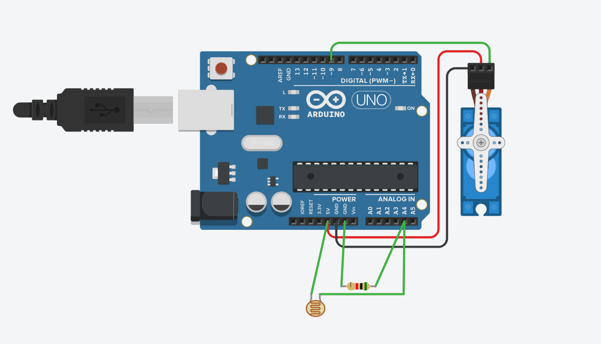
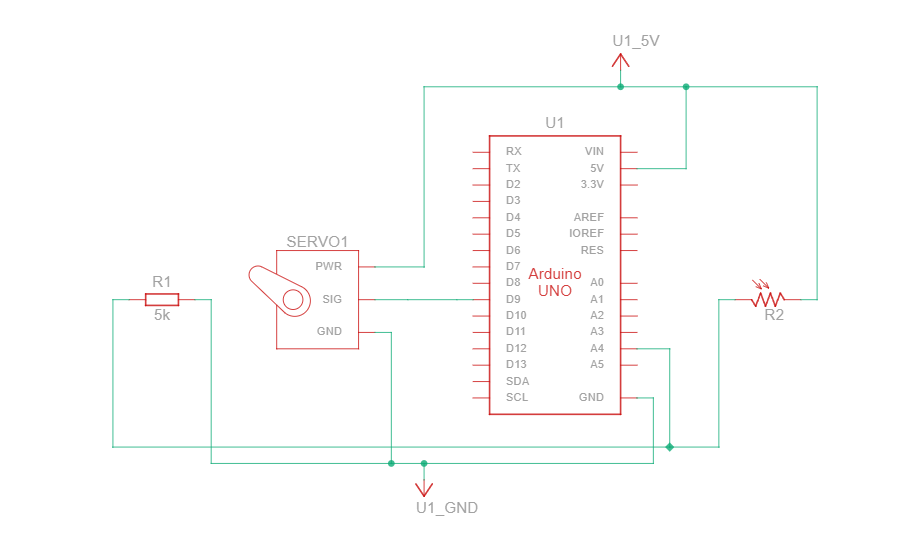

# Servo Temperature Display

## Description

This project is a servo motor control system that responds to temperature changes. A temperature sensor (TMP36) measures the surrounding temperature, and based on the temperature value, a servo motor moves to different angles. This project combines analog input reading, temperature conversion, and servo motor control.

## Working Principle

The Arduino reads the temperature from the TMP36 sensor connected to an analog pin.

- The TMP36 produces an analog voltage that varies with temperature
- The Arduino reads this voltage and converts it to temperature in Celsius
- Based on the temperature value, the servo motor moves to different angles:
  - **Below 15°C** → Servo at 0° (Cold)
  - **15-20°C** → Servo at 45° (Cool)
  - **20-25°C** → Servo at 90° (Moderate)
  - **25-30°C** → Servo at 135° (Warm)
  - **Above 30°C** → Servo at 180° (Hot)
- Temperature and angle values are displayed in the Serial Monitor

## Components Required

- Arduino Uno
- Servo Motor (SG90 or similar)
- TMP36 Temperature Sensor
- Breadboard
- Jumper Wires

## Pin Connections

| Component | Arduino Pin |
|-----------|------------|
| TMP36 Signal (middle pin) | A0 |
| TMP36 VCC | 5V |
| TMP36 GND | GND |
| Servo Signal | Pin 9 |
| Servo VCC | 5V |
| Servo GND | GND |

## Circuit Diagram



## Schematic



### ASCII Servo Temperature Layout

```
TMP36 Temperature Sensor:
┌─────────────────────┐
│  VCC  VOUT  GND     │
│   │    │    │       │
│   ●    ●    ●       │
│   │    │    │       │
│   5V   A0   GND     │
└─────────────────────┘

Servo Motor Connection:
┌──────────────────────────┐
│  Signal  VCC  GND        │
│   │      │    │          │
│   ●      ●    ●          │
│   │      │    │          │
│   P9     5V   GND        │
└──────────────────────────┘

                    Arduino Uno
                    ┌─────────────┐
        A0      ────┤ A0 (Temp)   │
                    │             │
        Pin 9   ────┤ 9 (Servo)   │
                    │             │
                    │  5V    GND ─┤─────
                    │             │
                    └─────────────┘
```

**Note:** The circuit diagram image (circuit.png) should be placed in the same folder as this README.

## Temperature to Angle Mapping

| Temperature | Servo Angle | Status |
|-------------|-------------|--------|
| < 15°C | 0° | Cold |
| 15-20°C | 45° | Cool |
| 20-25°C | 90° | Moderate |
| 25-30°C | 135° | Warm |
| > 30°C | 180° | Hot |

## Features

- Reads temperature using TMP36 sensor
- Converts analog value to temperature in Celsius
- Controls servo motor position based on temperature
- Displays temperature and servo angle in Serial Monitor
- Beginner-friendly temperature monitoring project
- Combines analog input, calculation, and servo control

## Applications

- Temperature monitoring systems
- Weather station basics
- Automatic temperature-response systems
- Beginner sensor interfacing practice
- Educational embedded systems project

## Code Summary

```cpp
#include <Servo.h>

Servo servo;
const int tempSensorPin = A0;
const int servoPin = 9;

void setup() {
  servo.attach(servoPin);
  Serial.begin(9600);
  Serial.println("Servo Temperature Control");
}

void loop() {
  int sensorValue = analogRead(tempSensorPin);
  float voltage = sensorValue * (5.0 / 1023.0);
  float temperature = (voltage - 0.5) * 100;  // Convert to Celsius
  
  int servoAngle;
  String status;
  
  if (temperature < 15) {
    servoAngle = 0;
    status = "Cold";
  } else if (temperature < 20) {
    servoAngle = 45;
    status = "Cool";
  } else if (temperature < 25) {
    servoAngle = 90;
    status = "Moderate";
  } else if (temperature < 30) {
    servoAngle = 135;
    status = "Warm";
  } else {
    servoAngle = 180;
    status = "Hot";
  }
  
  servo.write(servoAngle);
  
  Serial.print("Temp: ");
  Serial.print(temperature);
  Serial.print("C | Angle: ");
  Serial.print(servoAngle);
  Serial.print(" | ");
  Serial.println(status);
  
  delay(500);
}
```

## Expected Output

```
Temp: 18.5C | Angle: 45 | Cool
Temp: 22.3C | Angle: 90 | Moderate
Temp: 28.1C | Angle: 135 | Warm
```

---

**Author**: Beginner Arduino Projects  
**Difficulty Level**: Intermediate ⭐⭐
