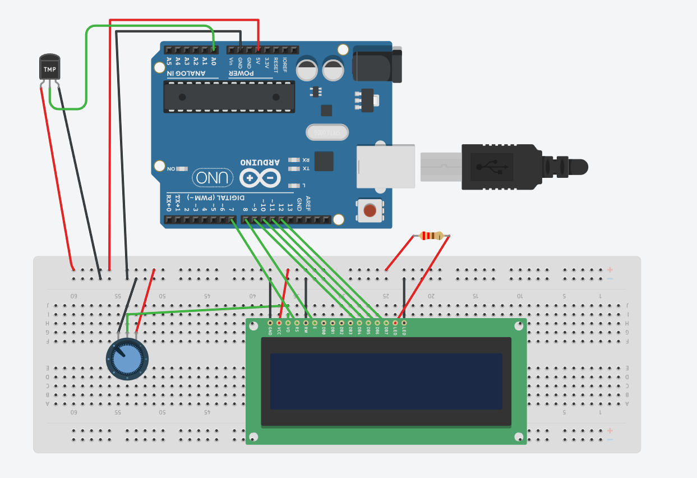
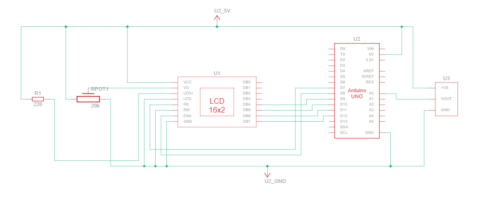

# Temperature Sensor

## Description

This project is a temperature monitoring system using an Arduino, TMP36 temperature sensor, and serial communication. The TMP36 sensor measures the surrounding temperature and sends an analog voltage signal to the Arduino. The Arduino converts this analog value into temperature in Celsius and displays it continuously on the Serial Monitor.

## Working Principle

The TMP36 sensor produces an analog voltage that varies according to temperature.

The Arduino reads this analog voltage through analog pin A0 using `analogRead()`. The analog value is then converted into voltage and finally into temperature in Celsius using mathematical conversion formulas.

### Conversion Process

**1. Analog Value to Voltage**

The Arduino reads values from **0 to 1023** because of its **10-bit ADC (Analog to Digital Converter)**.

The voltage is calculated using:
```
Voltage = Sensor Value × (5.0 / 1023.0)
```

Where:
- **5.0V** = Arduino operating voltage
- **1023** = maximum ADC value

**2. Voltage to Temperature**

The TMP36 sensor gives:
- **0.5V at 0°C**
- Increases by **10mV (0.01V) per °C**

Temperature is calculated using:
```
Temperature (°C) = (Voltage − 0.5) × 100
```

### Example Conversion

If the sensor outputs **0.75V**:
```
Temperature = (0.75 − 0.5) × 100 = 25°C
```

## Components Required

- Arduino Uno
- TMP36 Temperature Sensor
- Breadboard (optional)
- Jumper Wires

## Pin Connections

| Component | Arduino Pin |
|-----------|------------|
| TMP36 VCC (Left pin) | 5V |
| TMP36 VOUT (Middle pin) | A0 |
| TMP36 GND (Right pin) | GND |

## Circuit Diagram



## Schematic



### ASCII Temperature Sensor Layout

```
TMP36 Temperature Sensor:
(Keep the flat side facing you)

┌─────────────────────────┐
│  VCC    VOUT    GND     │
│   │      │       │      │
│   ●      ●       ●      │
│   │      │       │      │
│   5V     A0      GND    │
└─────────────────────────┘

                    Arduino Uno
                    ┌─────────────┐
        5V      ────┤ 5V          │
                    │             │
        A0      ────┤ A0 (Temp)   │
                    │             │
                    │       GND ──┤────────
                    │             │
                    └─────────────┘

Breadboard (Optional):
┌────────────────────────────────┐
│  VCC   VOUT   GND              │
│   │      │      │              │
│   ●      ●      ●              │
│   │      │      │              │
│   5V     A0     GND            │
└────────────────────────────────┘
```

**Note:** The circuit diagram image (circuit.png) should be placed in the same folder as this README.

## Features

- Displays real-time temperature readings
- Shows temperature in Celsius
- Outputs temperature to Serial Monitor
- Beginner-friendly Arduino project
- Demonstrates analog sensor interfacing
- Demonstrates ADC conversion and calculations
- Compact and simple setup

## Applications

- Temperature monitoring systems
- Weather monitoring basics
- Home automation projects
- Embedded systems learning
- Sensor interfacing practice
- Data logging applications

## Code Summary

```cpp
const int tempSensorPin = A0;

void setup() {
  Serial.begin(9600);
  Serial.println("Temperature Sensor - TMP36");
  Serial.println("Temperature (C) | Voltage (V) | Raw Value");
}

void loop() {
  int sensorValue = analogRead(tempSensorPin);
  float voltage = sensorValue * (5.0 / 1023.0);
  float temperature = (voltage - 0.5) * 100;  // Convert to Celsius
  
  Serial.print("Temp: ");
  Serial.print(temperature);
  Serial.print("C | Voltage: ");
  Serial.print(voltage);
  Serial.print("V | Raw: ");
  Serial.println(sensorValue);
  
  delay(1000);  // Read every 1 second
}
```

## Expected Output

```
Temperature Sensor - TMP36
Temperature (C) | Voltage (V) | Raw Value
Temp: 20.1C | Voltage: 2.01V | Raw: 410
Temp: 20.3C | Voltage: 2.03V | Raw: 415
Temp: 20.2C | Voltage: 2.02V | Raw: 412
```

## Temperature Range

| Min | Typical | Max |
|-----|---------|-----|
| -40°C | 25°C | 125°C |
| -0.5V | 2.5V | 6.25V |

## Troubleshooting

| Problem | Solution |
|---------|----------|
| No temperature reading | Check TMP36 connections and power supply |
| Readings too high/low | Verify pin connections and sensor orientation |
| Fluctuating readings | Add capacitor (0.1µF) across VCC and GND for filtering |

## Tips

- Keep sensor away from Arduino heat
- Add delay between readings for stability
- Use moving average for smoother readings
- Sensor has 5-10°C offset; calibrate if needed

---

**Author**: Beginner Arduino Projects  
**Difficulty Level**: Beginner ⭐
