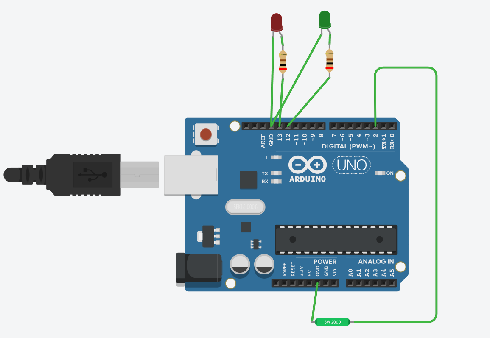
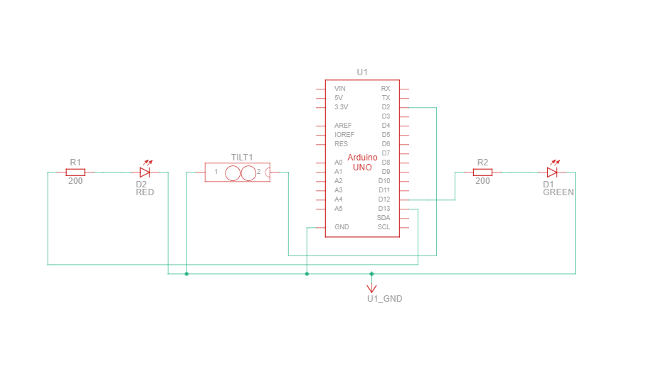

# Tilt Sensor

## Description

This project is a beginner-friendly Arduino tilt sensor project using a tilt switch and two LEDs. The system detects the orientation of the tilt switch and indicates the state using LED colors. When the tilt switch is tilted/activated, the red LED glows. When the tilt switch is in normal position, the green LED glows. This project helps beginners understand how digital sensors work using Arduino.

## Working Principle

The Arduino reads the digital signal from the tilt switch connected to a digital input pin.

The tilt switch behaves like an **ON/OFF sensor**:
- When tilted, the internal metal contact completes the circuit and sends a signal
- When not tilted, the circuit remains open

The project uses **INPUT_PULLUP mode**, meaning the Arduino internally maintains a HIGH signal.

The output works as follows:
- **Tilt detected (LOW)** → Red LED ON, Green LED OFF
- **No tilt (HIGH)** → Green LED ON, Red LED OFF

The tilt switch state is also displayed in the Serial Monitor for testing and debugging.

## Components Required

- Arduino Uno
- Tilt Switch
- 1 × Red LED
- 1 × Green LED
- 2 × 220Ω Resistors
- Jumper Wires

## Pin Connections

| Component | Arduino Pin |
|-----------|------------|
| Tilt Switch Pin 1 | GND |
| Tilt Switch Pin 2 | Pin 2 |
| Red LED (positive through 220Ω) | Pin 13 |
| Red LED (negative) | GND |
| Green LED (positive through 220Ω) | Pin 12 |
| Green LED (negative) | GND |

## Circuit Diagram



## Schematic



### ASCII Tilt Sensor Layout

```
Tilt Switch (Ball-Type):
┌──────────────────────┐
│  When Tilted:        │
│  ●●●oo (Contact)     │
│  When Upright:       │
│  ●●●  (No Contact)   │
└──────────────────────┘

Tilt Switch Connections:
Pin 1 → GND
Pin 2 → Arduino Pin 2 (INPUT_PULLUP)

                    Arduino Uno
                    ┌─────────────┐
        Pin 2   ────┤ 2 (Tilt)    │
                    │             │
        Pin 13  ────┤ 13 (Red)    │
                    │             │
        Pin 12  ────┤ 12 (Green)  │
                    │             │
                    │       GND ──┤────────┐
                    │             │        │
                    └─────────────┘        │
                                          │
    Breadboard:                           │
    ┌────────────────────────────────┐   │
    │  Red LED   Green LED           │   │
    │   ●(+)      ●(+)               │   │
    │   │         │                  │   │
    │   ├220Ω─┐   ├220Ω────────────┬─┼───┤ GND
    │   │     │   │                │ │   │
    └───┼─────┴───┴────────────────┘ │   │
        │                            │   │
        └────────────────────────────┘   │
                                         │
        Tilt Switch connection:         │
        Pin 2 (from Arduino) ───────────┘
```

**Note:** The circuit diagram image (circuit.png) should be placed in the same folder as this README.

## Tilt Switch States

| Orientation | Signal | Red LED | Green LED |
|-----------|--------|---------|-----------|
| Tilted (Activated) | LOW | ON | OFF |
| Upright (Normal) | HIGH | OFF | ON |

## Features

- Detects tilt orientation using a tilt switch
- Beginner-friendly Arduino project
- Uses two LEDs for visual indication
- Demonstrates digital input sensing
- Uses Arduino **INPUT_PULLUP**
- Displays sensor state in Serial Monitor
- No breadboard required (direct connections)
- Easy to modify for alarm systems

## Applications

- Tilt detection systems
- Anti-theft alarms
- Motion sensing projects
- Safety monitoring systems
- Educational demonstration project
- Beginner embedded systems practice

## Code Summary

```cpp
const int tiltPin = 2;    // Tilt sensor input
const int redLED = 13;    // Red LED output
const int greenLED = 12;  // Green LED output

void setup() {
  pinMode(tiltPin, INPUT_PULLUP);
  pinMode(redLED, OUTPUT);
  pinMode(greenLED, OUTPUT);
  Serial.begin(9600);
  Serial.println("Tilt Sensor Initialized");
}

void loop() {
  int tiltState = digitalRead(tiltPin);
  
  Serial.print("Tilt State: ");
  Serial.println(tiltState);
  
  if (tiltState == LOW) {
    // Tilted - Turn on Red LED
    digitalWrite(redLED, HIGH);
    digitalWrite(greenLED, LOW);
    Serial.println("TILTED - Red LED ON");
  } else {
    // Upright - Turn on Green LED
    digitalWrite(redLED, LOW);
    digitalWrite(greenLED, HIGH);
    Serial.println("UPRIGHT - Green LED ON");
  }
  
  delay(500);
}
```

## Expected Output

```
Tilt Sensor Initialized
Tilt State: 1
UPRIGHT - Green LED ON
Tilt State: 0
TILTED - Red LED ON
Tilt State: 1
UPRIGHT - Green LED ON
```

## Troubleshooting

| Problem | Solution |
|---------|----------|
| LEDs don't respond to tilt | Check switch connections and polarity |
| Reversed logic | Check if LOW/HIGH conditions are correct |
| No Serial output | Verify baud rate is 9600 |

## Tips

- Tilt switch has two metal pins - ensure proper connection
- The ball inside makes contact when tilted
- Works best when tilted beyond 30-45 degrees
- Can be used to detect sudden movements

## Variations

- Add buzzer for audio alert when tilted
- Display tilt angle using accelerometer
- Create a spirit level indicator
- Build a motion-activated alarm

---

**Author**: Beginner Arduino Projects  
**Difficulty Level**: Beginner ⭐
